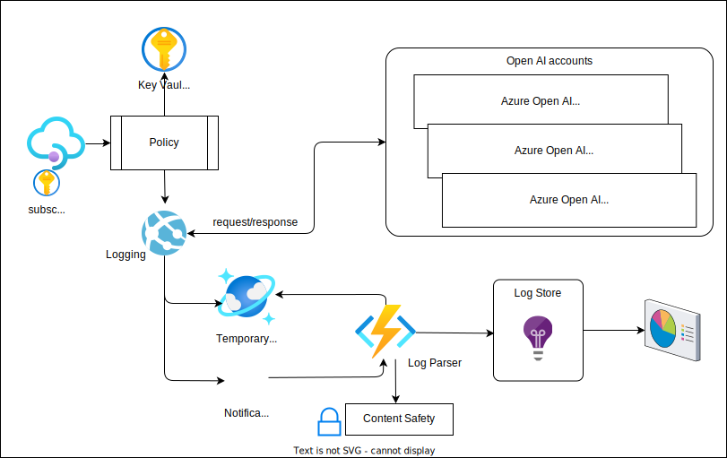

# Azure API Management(APIM) Log parser for Azure Open AI(AOAI)

As described in [the challenges](../README.md#challenges-of-azure-open-ai-in-production), one of the issue when monitoring the AOAI accounts is the inconsistency of response format depending on the models, features to use, and ``stream`` or ``non-stream`` mode for Completion endpoints.

For example, the stream mode responses do not contain, not only token usage information, but also it's difficult to read the result as each response contains just a snippet of the generated answer.

This C# sample application demonstrate how to parse these logs to make them identical so that it is easier to create reports and dashboards.

# Architecture



1. The log parser fetches the logs from the Azure Event Hub, which stores the forwarded logs from the APIM.
1. Depending on the response type, it converts the logs into uniform format.
1. Then it sends the converted logs to log store, such as Application Insights and Cosmos DB for further analysis.

## Features

The log parser does:

- Combine a request and the corresponding response into single log.
- Combine multiple stream responses into a single response by joining the content, then calculate token usage and content safeness.
- Send the log to multiple destinations by using Serilog.

### Limitation

We are not logging the function calling response when using streaming mode at the moment.

# How to run the log parser

The log parser is a C# console application. We can run it locally as C# binary or build it as a docker container to run it on docker runtime, such as Docker Desktop, Azure Container Instance, etc.

## appsettings.json

Rename the ``__appsettings.json`` into ``appsettings.json`` and fill the necessary information. 

- __EventHubConnectionString__: We need ``Listen`` policy.
- __BlobStorageConnectionStorage__: We can use SAS Token or Key connecting string.
- __BlobContainerName__: The conatiner name to store event hub checkpoint.
- __CosmosDbUrl__ and __CosmosDbKey__: The CosmosDB access information to store the log documents.
- __CosmosDbDatabaseName__: The database name to store the log documents.
- __ContentSafetyUrl__ and __ContentSafetyKey__: The content safety service endpoint and key.
- __ApplicationInsightsConnectionString__: The application insights connection string to store the log trace.

## Run locally as a C# binary

You can run by dotnet runtime or use any IDE to run the program.

```shell
cd LogParser
dotnet run
```

## Run as a docker container

We provide [Dockerfile](../Dockerfile) in this repo.

```shell
cd <root of the repo>
docker build -t <name of the image> .
docker run <name of the image>
```

## Use KeyVault (Optional)

As a security best practice, store connecting strings and secrets in Azure KeyVault, then retrieve them at runtime.

## Use Managed Identity (Optional)

Another way so secure the access is to use Managed Identity, if the application run in Azure services.

# Stream Log Parser

GPT models returns responses token by token when we use stream mode, so that we can return the results little by little to consumer. See [How to stream completion](https://cookbook.openai.com/examples/how_to_stream_completions) for more detail.

As described in the article, one of [the downsides](https://cookbook.openai.com/examples/how_to_stream_completions#downsides) is that it doesn't contain ``usage`` field that tells us how many tokens were consumed.

To solve this challenge, the log parser accumulates all the responses and concatenates the content, then calculates the token usage by using [TiktokenSharp](https://github.com/aiqinxuancai/TiktokenSharp).

Another challenge is that the response content safety check may not be accurate as it returns token by token. The log parser sends the concatenated result to [Azure Content Safety](https://learn.microsoft.com/azure/ai-services/content-safety/overview) service to analyze it.

# Log the results

We use [Serilog](https://serilog.net/) to log the result to multiple destinations. Serilog supports multiple __sinks__ not only Azure Services, but also other vendor's services. The application logs to Application Insights and Cosmos DB as a sample, but you don't necessary need to log them in multiple desitnations.

See [Provided Sinks](https://github.com/serilog/serilog/wiki/Provided-Sinks) for more detail.